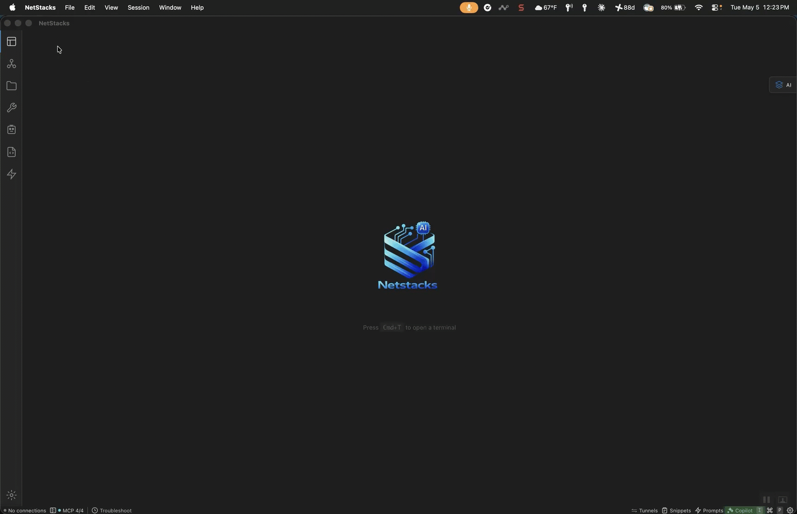

# NetStacks

### The SSH Terminal that thinks with you.

SSH, Telnet, and SFTP with an encrypted credential vault, network-aware AI, and topology visualization.
Built for network engineers. Open source under Apache 2.0.

[Download](https://netstacks.net/download) &nbsp;&bull;&nbsp; [Documentation](https://www.netstacks.net/docs) &nbsp;&bull;&nbsp; [Blog](https://netstacks.hashnode.dev)

---

---

### What you get

- **Multi-tab terminal** — SSH, Telnet, SFTP with split panes, broadcast commands, session recording, and live session sharing
- **Encrypted credential vault** — passwords, keys, SNMP communities, and API tokens encrypted locally with auditable crypto ([netstacks-crypto](https://github.com/netstacks/netstacks-crypto))
- **Network-aware AI assistant** — vendor-specific knowledge packs for Cisco IOS/NX-OS, Juniper JunOS, and Arista EOS with hardcoded safety rails and credential sanitization
- **NOC Agents** — autonomous monitoring and triage using the ReAct pattern with human-in-the-loop approval
- **Jinja2 config templates** — version-controlled templates with variable discovery, diff, validation, and dry-run rendering
- **Topology visualization** — 2D/3D interactive maps via SNMP, LLDP/CDP, and Nmap discovery with click-to-connect
- **NetBox, LibreNMS, and Netdisco integration** — sync devices, pull topology, enrich inventory
- **Methods of Procedure** — structured change management with multi-approver workflows and risk classifications
- **Scheduled tasks** — cron-based automation for backups, health checks, and compliance audits
- **Python scripting** — built-in editor with PEP 723 dependency management via `uv`

### No tiers. No feature gates. No telemetry. Free forever for individuals.

---

### Repositories

| Repo | Description |
|------|-------------|
| [netstacks-terminal](https://github.com/netstacks/netstacks-terminal) | Desktop terminal + local agent (Tauri/Rust) |
| [netstacks-crypto](https://github.com/netstacks/netstacks-crypto) | Auditable credential vault crypto primitives |
| [netagent](https://github.com/netstacks/netagent) | AI Agents platform for network engineers |

---

**[Get started in under 5 minutes &rarr;](https://www.netstacks.net/docs/getting-started)**

